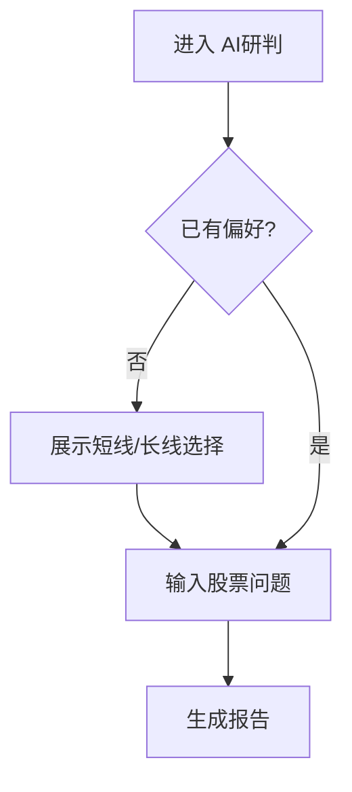

# AI研判产品设计文档

更新时间：2026-04-28

## 1. 页面信息架构

页面路径：`/ai-report`

页面由上到下分为：

1. 页面标题区：说明这是“一句话生成股票走势报告”。
2. 偏好区：首次进入展示短线/长线选择；已选择后变为顶部切换控件。
3. 输入区：自然语言输入框、示例问题、生成按钮。
4. 低置信度候选区：只在识别置信度低时展示最多 3 个股票候选。
5. 报告区：结论卡、三灯风险卡、短线/长线重点、数据状态。
6. 底部提示：报告仅作辅助研判。

## 2. 首次使用流程

设计原则：

- 不弹复杂弹窗，直接在页面主体展示偏好选择。
- 两个选项使用大按钮，说明各自会保留哪些内容。
- 选择后立即进入输入状态。

## 3. 输入区设计

输入区只保留必要操作：

- 一个输入框。
- 一个“生成报告”按钮。
- 三个示例问题。

输入框占主要宽度，按钮固定在右侧；移动端垂直排列。

按钮状态：

- 无偏好或无输入时禁用。
- 请求中显示加载图标和“正在生成”状态。

## 4. 报告展示设计

### 4.1 结论卡

结论卡放在报告第一块，必须一眼可见。

展示内容：

- 结论标签：看涨、观望、看跌、回避。
- 结论标题。
- 摘要。
- 股票代码、名称、识别置信度。

颜色规则：

- 绿色：倾向安全或积极。
- 黄色：需要观察。
- 红色：风险突出。

### 4.2 三灯风险卡

三张并列卡：

- 汇率波动
- 主力资金流向
- 机构持仓变化

每张卡包含状态、当前值、原因和小趋势图。没有趋势数据时显示“暂无趋势图”，不补假图。

### 4.3 短线内容

短线用户只看：

- 技术面
- 资金动向
- 明日涨跌概率

明日涨跌概率使用双进度条，不写成长段文字。

### 4.4 长线内容

长线用户只看：

- 估值
- 财报
- 行业前景

每项控制为短摘要，避免输出重复风险提示。

### 4.5 数据状态

数据状态作为报告最后一块：

- `ok`：正常。
- `partial`：部分可用。
- `missing`：数据源暂缺，使用红色提示。

## 5. 视觉规范

- 沿用当前 AstraTrade 深色交易台风格。
- 卡片圆角不超过现有系统的 `rounded-lg`。
- 红绿灯颜色独立于 K 线涨跌色语义，绿色表示安全，红色表示危险。
- 不使用营销式大 Hero，不加入装饰插画。
- 重点信息用颜色、标签和位置突出，而不是长段解释。

## 6. 空状态与错误状态

空状态：

- 文案提示“输入一句股票问题，直接生成结论报告”。
- 不展示空图表或默认股票。

错误状态：

- 展示失败原因。
- 提供重试按钮。
- 不展示任何模拟报告。

