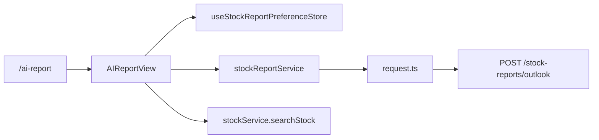

# AI研判技术架构文档

更新时间：2026-04-28

## 1. 实现范围

本次新增独立页面 `/ai-report`，实现报告生成入口、偏好持久化、结构化报告展示和低置信度候选逻辑。
同时提供一个本地开发 API 服务，监听 `http://127.0.0.1:8080`，用于在当前前端仓库内跑通 AI研判全流程。

新增文件：

- `src/views/AIReportView/index.tsx`
- `src/views/AIReportView/reportUtils.ts`
- `src/types/stockReport.ts`
- `src/services/stockReportService.ts`
- `src/store/useStockReportPreferenceStore.ts`
- `tests/stockReportFlow.test.ts`
- `scripts/run-stock-report-tests.mjs`
- `server/index.mjs`
- `server/stock-report/*`
- `tests/stockReportApi.test.mjs`

修改文件：

- `src/router/index.tsx`
- `src/components/NavigationMenu/index.tsx`
- `package.json`

## 2. 前端架构



职责划分：

- 页面层：管理输入、加载、错误、候选和报告展示。
- Store 层：只保存 `short | long` 偏好，不保存报告内容。
- Service 层：封装后端聚合接口。
- Utils 层：封装请求构造、标签映射、置信度判断、概率归一化。
- 本地 API 层：封装股票识别、报告组装和缺失数据声明。

## 2.1 本地 API 服务

开发命令：

```bash
npm run dev:api
```

服务能力：

- `POST /api/stock-reports/outlook`：AI研判聚合接口。
- `GET /api/stocks/search`：低置信度候选股票搜索。
- `GET /api/stocks`、`GET /api/stocks/:symbol`：开发用股票基础信息。
- `POST /api/auth/login`：支持 `demo@example.com / test123` 登录，方便进入受保护页面。

注意：本地 API 只提供股票识别和结构化报告闭环；汇率、主力资金、机构持仓、估值、财报、行业前景等真实数据源仍返回 `dataQuality.missing`，不输出伪造市场结论。

## 3. 接口契约

前端调用：

```ts
POST /api/stock-reports/outlook
```

请求：

```ts
{
  query: string;
  symbol?: string;
  horizon: 'short' | 'long';
  locale: 'zh-CN';
}
```

响应：

```ts
{
  reportId: string;
  generatedAt: string;
  resolvedStock: {
    symbol: string;
    name: string;
    sector?: string;
    region?: string;
    confidence: number;
  };
  recommendation: {
    action: 'bullish' | 'neutral' | 'bearish' | 'avoid';
    title: string;
    summary: string;
    confidence: number;
    highlight: 'green' | 'yellow' | 'red';
  };
  trafficLights: Array<{
    key: 'fx' | 'capital_flow' | 'institution_holding';
    status: 'green' | 'yellow' | 'red';
    title: string;
    value: string;
    reason: string;
    series?: Array<{ timestamp: number; value: number }>;
  }>;
  shortTerm?: {
    technical: string;
    capitalFlow: string;
    nextDayProbability: { up: number; down: number };
  };
  longTerm?: {
    valuation: string;
    earnings: string;
    industryOutlook: string;
  };
  dataQuality: Array<{ key: string; status: 'ok' | 'partial' | 'missing'; message: string }>;
}
```

## 4. 数据策略

- 汇率波动、主力资金流向、机构持仓变化必须由后端聚合接口返回。
- 前端不通过随机数、K线推断或静态 mock 补齐关键三灯数据。
- `dataQuality.missing` 时，页面展示“数据源暂缺”。
- 聚合接口失败时展示错误和重试，不回退到 AI 对话或本地假报告。

## 5. 复用现有能力

已复用：

- `request.ts`：统一 HTTP、鉴权和错误处理。
- `stockService.searchStock`：低置信度时查询最多 3 个候选。
- 全局导航和 `ProtectedRoute`：入口与登录保护延续现有结构。
- CSS 变量和 Tailwind：保持深色交易台风格。

未复用：

- `ChatPanel` 和 `/ai/analyze`：本功能需要结构化报告，不适合直接消费自由文本。
- `ChartPanel`：报告只需要轻量趋势展示，不需要完整 K 线工作台。

## 6. 状态管理

`useStockReportPreferenceStore` 使用 Zustand persist：

```ts
{
  horizon: 'short' | 'long' | null;
  setHorizon(horizon);
  resetHorizon();
}
```

报告结果只存在页面内存中，刷新后不恢复。后续如需要报告历史，应接后端报告列表接口。

## 7. 测试与回归

新增命令：

```bash
npm run test:stock-report
```

覆盖：

- 请求构造。
- 低置信度候选判断。
- 红绿灯和结论标签映射。
- 概率归一化。
- 短线/长线展示字段互斥。

推荐回归：

```bash
npm run test:stock-report-api
npm run test:stock-report
npm run test:ai-chat
npm run build
```

说明：仓库历史上全量 `typecheck` 和 `lint` 存在既有问题，本功能以新增测试和构建作为首要回归标准。
