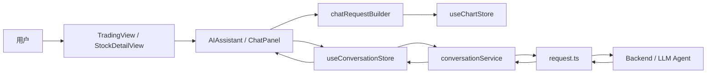
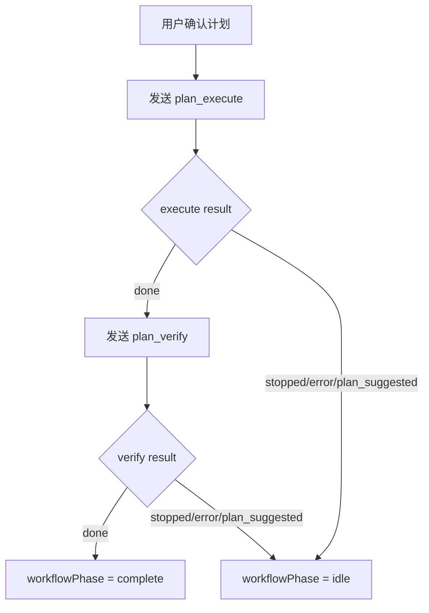

# AstraTrade 技术设计文档

更新时间：2026-04-28

## 1. 项目定位

AstraTrade 是股票分析与 AI 辅助决策前端。当前产品重点不是泛聊天工具，而是围绕行情图表和 K 线数据上下文，提供三类 AI 工作流：

- 普通对话：用户自由提问，适合临时分析、解释指标、追问市场逻辑。
- 模板/场景对话：用户选择分析模板或场景，前端传 `sceneId`，后端根据场景加载对应 prompt。
- 规划执行：AI 先生成可确认的分析计划，用户确认后执行，再对执行结果做校验。

前端的核心职责是：组织 UI、采集上下文、构建结构化请求、展示流式响应、管理会话状态。模板正文、复杂 prompt 策略和最终推理策略应尽量由后端承接。

## 2. 总体架构



### 前端分层

- 页面层：`src/views/*`
  - 负责页面组合、布局和路由级状态。
- 组件层：`src/components/*`
  - `AIAssistant` 负责 AI 交互。
  - `ChartPanel` 负责图表、绘图与 K 线交互。
- Store 层：`src/store/*`
  - `useConversationStore` 管理会话、消息、流式状态、规划状态。
  - `useChartStore` 管理当前图表上下文和用户确认的 K 线选择。
  - `useAIConfigStore` 管理模型、供应商、场景选择。
- Service 层：`src/services/*`
  - `conversationService` 封装会话、消息、planner 和 SSE。
  - `request.ts` 是通用 HTTP 基础层。
- Type 层：`src/types/*`
  - 保存前后端契约和 UI 状态类型。

## 3. AI 对话三链路

### 3.1 普通对话

入口：`ChatInput -> ChatPanel.handleSend`

语义：用户自由输入，前端构建 `mode = normal` 的请求。

请求关键字段：

- `content`
- `modelId`
- `providerId`
- `sceneId`
- `expectedType = markdown`
- `stream = true`
- `klineContext?`

说明：普通对话也继续携带 `sceneId`，默认场景通常为 `general`。这样后端可以统一记录和路由。

### 3.2 模板/场景对话

入口：`ChatInput` 中选择模板/场景后发送消息。

语义：当前“模板对话”等价于“后端场景模板对话”。前端不保存模板正文，只传 `sceneId`。

请求关键字段和普通对话一致，区别是：

- `mode = template`
- `sceneId` 为用户选择的场景 ID

设计原因：

- 模板 prompt 由后端维护，便于统一版本管理和灰度。
- 前端只负责用户选择和上下文传递。
- 避免前端散落模板正文，减少安全和一致性问题。

### 3.3 规划执行

入口：`PlannerPanel -> ChatPanel.handleApprovePlan`

规划执行分为两个阶段：

1. `plan_execute`：基于用户确认的计划执行完整分析。
2. `plan_verify`：对执行结果做质量审查和风险校验。

执行控制：

- `sendChatMessage` 返回 `ChatRunResult`。
- 只有 execute 返回 `{ status: 'done' }` 才进入 verify。
- execute 返回 `stopped`、`error`、`plan_suggested` 时，不进入 verify。
- verify 失败或停止时，工作流回到可操作状态，不标记 complete。



## 4. 请求构建层

文件：`src/components/AIAssistant/chatRequestBuilder.ts`

核心类型：

```ts
export type ChatRequestMode =
  | 'normal'
  | 'template'
  | 'plan_execute'
  | 'plan_verify';
```

核心函数：

- `buildBaseChatRequest`
  - 统一写入 `content/modelId/providerId/sceneId/expectedType/stream`。
  - 根据 mode 写入 `workflowStage = execute | verify`。
  - 接收可选 `klineContext` 和 `systemPrompt`。
- `takeKLineContextSnapshot`
  - 优先使用用户确认的 K 线区间。
  - 没有确认区间时使用当前图表上下文。
  - 使用确认区间后清空该选择，避免重复附带旧上下文。
- `ensureConversationForChat`
  - 如果已有 active conversation，直接复用。
  - 否则创建新会话，并读取 store 中的新 active id。
- `buildPlanSystemPrompt`
  - 当前后端尚未提供结构化 plan execute 接口时，前端临时集中封装计划执行 system prompt。
  - 长期方向是迁移到后端。
- `shouldRunVerify`
  - 对 `ChatRunResult` 做单一判断：只有 `done` 才继续校验。

## 5. 流式执行与返回结果

文件：`src/store/useConversationStore.ts`

`sendChatMessage` 当前返回：

```ts
export type ChatRunStatus =
  | 'done'
  | 'stopped'
  | 'error'
  | 'plan_suggested';

export interface ChatRunResult {
  status: ChatRunStatus;
  assistantMessageId?: string;
  error?: string;
}
```

### 状态含义

- `done`：后端 SSE 正常返回完成事件。
- `stopped`：用户主动停止或 AbortController 中断。
- `error`：后端 error 事件、超时或请求异常。
- `plan_suggested`：后端返回计划建议，UI 应展示规划卡片，不应当当作普通完成。

### UI 行为约束

- 保持流式展示行为不变。
- 调用方不再通过异常猜测执行结果，而是读取 `ChatRunResult`。
- 规划执行不在 UI 层硬编码“执行后必然校验”。

## 6. 消息内容解析

文件：`src/services/messageContentParser.ts`

修正点：

- 用户消息永远按原始文本展示。
- 不再无差别对所有字符串做 `JSON.parse`。
- 只有 assistant 消息符合 Agent envelope 结构时才解析成对象。

设计原因：

- 用户发送 `{"foo": "bar"}` 应该是普通文本。
- Agent 消息需要保留 `text/toolCalls/thinking` 等结构给渲染层使用。

## 7. K 线上下文策略

K 线上下文来自 `useChartStore`：

- `confirmedSelectionData`：用户明确选择并确认的一段 K 线区间。
- `currentChartContext`：当前图表的可见或默认上下文。

发送消息时快照规则：

1. 优先使用 `confirmedSelectionData`。
2. 如果使用了确认选择，发送后立即清空。
3. 如果没有确认选择，则使用 `currentChartContext`。
4. 如果没有任何图表上下文，则不传 `klineContext`。

这样可以保证用户明确选区优先，同时避免旧选区重复污染后续对话。

## 8. 已清理链路

本轮已移除：

- 过时 docs。
- 未接入当前产品方向的 guidance UI 和 service。
- 未使用的 ChatInput/ChatPanel 类型文件。
- 图片上传入口。

保留策略：

- 如果后端仍存在兼容字段，不在本轮强制删除后端接口。
- 前端 UI 不再暴露未接入能力。

## 9. API 交互概览

主要由 `conversationService` 封装：

- `GET /conversations`
- `GET /conversations/:id`
- `POST /conversations`
- `POST /conversations/:id/chat`
- `POST /conversations/:id/chat/stream`
- `GET /conversations/:id/planner-state`
- `POST /conversations/:id/planner/enter`
- `POST /conversations/:id/planner/respond`

SSE 事件类型：

- `meta`
- `plan_suggestion`
- `delta`
- `thinking`
- `tool_start`
- `tool_result`
- `turn_end`
- `done`
- `error`
- `ping`

## 10. 测试策略

当前新增轻量 TDD 测试：

```bash
npm run test:ai-chat
```

覆盖内容：

- 普通对话请求构建。
- 模板/场景请求构建。
- 规划执行请求构建。
- execute 成功才进入 verify 的判断。
- execute stopped/error 不进入 verify。
- 用户 JSON 文本不被错误解析。
- assistant Agent envelope 可以被解析。
- K 线上下文快照优先级和清理行为。

其他回归命令：

```bash
npm run build
npx eslint src/components/AIAssistant/ChatInput/index.tsx src/components/AIAssistant/ChatPanel/index.tsx src/components/AIAssistant/chatRequestBuilder.ts src/components/AIAssistant/ConversationHistory/index.tsx src/services/conversationService.ts src/services/messageContentParser.ts src/store/useConversationStore.ts src/types/conversation.ts tests/aiChatFlow.test.ts scripts/run-ai-chat-tests.mjs
```

当前全仓 `typecheck` 和 `lint` 仍有历史问题，主要集中在：

- `ChartPanel`
- `MarkdownRenderer`
- `LineVolumeChart`
- `StockLineChart`
- `Table`
- `chartTheme`
- `request.ts` 和部分通用类型中的 `any`

这些问题不属于本次 AI 对话链路改造范围，建议单独排期。

## 11. 技术路线

### 短期

- 稳定 AI 三链路，继续补齐 store 和 service 测试。
- 清理全仓 typecheck/lint 历史问题。
- 明确后端 planner 和场景模板协议。
- 为手动回归建立固定用例。

### 中期

- 将规划执行 system prompt 从前端迁移到后端。
- 为 `plan_execute` 和 `plan_verify` 提供更结构化的后端接口。
- 引入更完整的测试框架，覆盖 store、service、关键 UI 交互。
- 对 AI 消息渲染做更强类型约束，减少 runtime 分支。

### 长期

- 接入真实多模态协议后再恢复图片上传。
- 模板/场景支持版本、灰度和可观测性。
- 对 Agent 工具调用、thinking、引用来源做更完整的结构化展示。
- 将行情、基本面、新闻、财报等数据源纳入统一上下文层。

## 12. 维护原则

- ChatPanel 只做 UI 调度，不直接拼重复请求。
- 请求构建集中在 builder。
- Store 返回明确执行结果，调用方不猜状态。
- 用户输入保持原样，不做隐式 JSON 解析。
- 模板 prompt 不下发到前端。
- 未接入后端的能力不展示入口。
